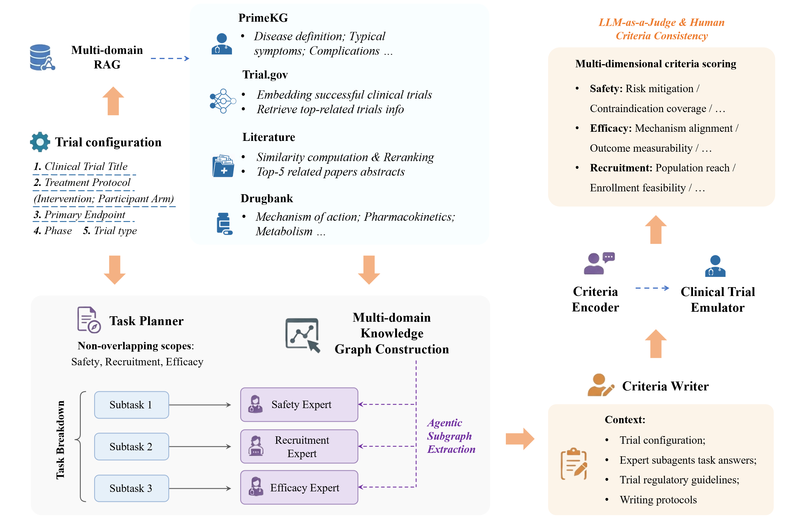
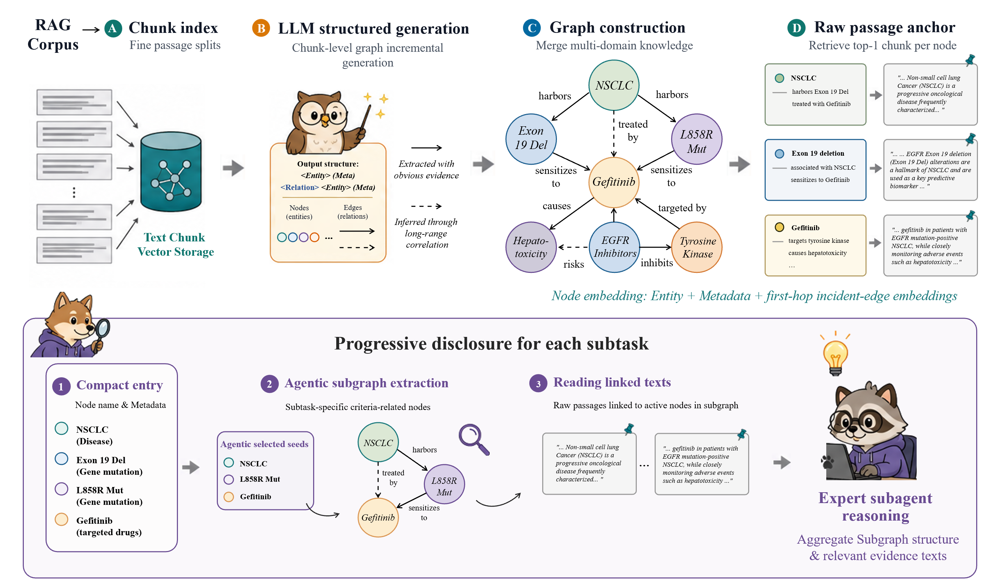

# CriteriaAgent

[](LICENSE)

Graph-augmented multi-agent framework for **clinical trial eligibility criteria** generation, with **[CriteriaBench](CriteriaBench/)** (78-trial benchmark) and progressive subgraph disclosure.

## Overview

Given a sparse trial stub (title, arms/interventions, primary endpoint, phase, and study type), CriteriaAgent:

1. **Retrieves** multi-domain evidence (disease, drug, literature, precedent trials)
2. **Builds** a trial-specific relation graph with passage-anchored nodes
3. **Decomposes** eligibility design into safety, efficacy, and recruitment subtasks
4. **Routes** each expert to task-relevant subgraphs via progressive disclosure (L0–L2)
5. **Writes** registry-style inclusion/exclusion criteria under regulatory guidelines
6. **Evaluates** drafts with a pairwise LLM judge and Consistency Index (CI)

<p align="center">
  
  <br />
  <sub><b>Figure 1.</b> System overview — retrieval, graph-augmented experts, criteria writer, and evaluation.</sub>
</p>

<p align="center">
  
  <br />
  <sub><b>Figure 2.</b> Trial-specific graph construction and agentic subgraph extraction for each expert subtask.</sub>
</p>

## Installation

```bash
pip install -r requirements.txt
cp .env.example .env   # Windows: copy .env.example .env
```

Edit `.env` with your API key and embedding model (see [Environment variables](#environment-variables)).

## Usage

### Smoke test

```bash
python scripts/run_criteria_agent.py \
  --graph examples/minoxidil/trial_graph.json \
  --config examples/minoxidil/trial_config.json \
  -o outputs/smoke_minoxidil
```

### Build a trial graph

```bash
python scripts/build_graph.py bench_profiles/<nct_id>.json -o outputs/my_graph.json
```

### CriteriaBench

| Mode | Command |
|------|---------|
| Direct generation | `python CriteriaBench/run_direct_gen_with_phase.py` |
| Full pipeline | `CRITERIA_BENCH_GEN_MODE=criteria_agent python CriteriaBench/run_criteria_bench_minimax.py` |
| Pairwise LLM judge | `python scripts/run_llm_judge_pairwise_with_phase.py` |
| Consistency Index | `python scripts/run_consistency_eval.py` |

Set `CRITERIA_BENCH_GEN_MODE` to `direct`, `vanilla_rag`, or `criteria_agent`.

## Repository layout

```
criteria_agent/          Multi-agent pipeline (planner → experts → writer)
trial_graph/             Graph build, subgraph extraction, embeddings
shared/                  LLM client, trial config, CT.gov formatting
scripts/                 CLI entry points
baselines/vanilla_rag/   Single-pass RAG baseline
CriteriaBench/           78-trial benchmark corpus + eval runners
bench_profiles/          Pre-built four-domain RAG profiles (78 trials)
examples/minoxidil/      End-to-end smoke test
figures/                 Paper figures
docs/                    Method notes
```

## CriteriaBench

**78** completed interventional drug trials from ClinicalTrials.gov (post–training-cutoff start dates). Generation inputs are public protocol metadata; registry expert criteria are withheld until evaluation.

| Resource | Path |
|----------|------|
| Trial corpus | `CriteriaBench/final_bench/trials/*.json` |
| Summary | `CriteriaBench/final_bench/summary.json` |
| Construction script | `CriteriaBench/create_new_bench.py` *(requires local CT.gov snapshot)* |
| Evaluation docs | [benchmark_evaluation_methodology.md](CriteriaBench/docs/benchmark_evaluation_methodology.md) |

## Environment variables

| Variable | Purpose |
|----------|---------|
| `ANTHROPIC_API_KEY` | API key for generation / judging |
| `ANTHROPIC_BASE_URL` | Anthropic-compatible endpoint (optional) |
| `GRAPH_MODEL` | LLM for graph extraction and agents |
| `ST_EMBED_MODEL` | Embedding model for graph routing & CI metric |
| `CRITERIA_BENCH_GEN_MODE` | `direct` · `vanilla_rag` · `criteria_agent` |

Full list in [`.env.example`](.env.example).

## Documentation

- [Method overview](docs/Method%20Overview.md)
- [Multi-dimensional graph & subgraph extraction](docs/Multi_Dimensional_Graph_and_Subgraph_Extraction.md)

## Citation

If you use this code or CriteriaBench, please cite our paper (forthcoming).

## License

This project is released under the [MIT License](LICENSE).
